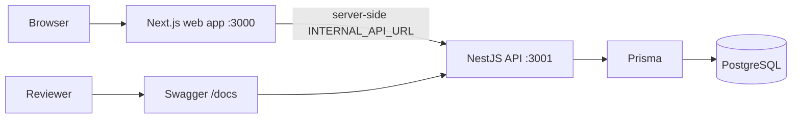
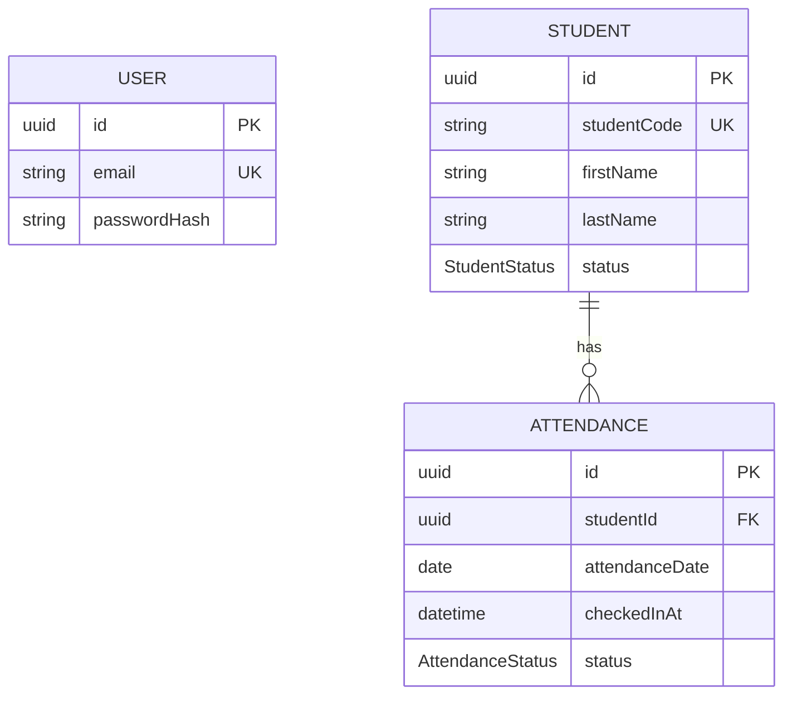
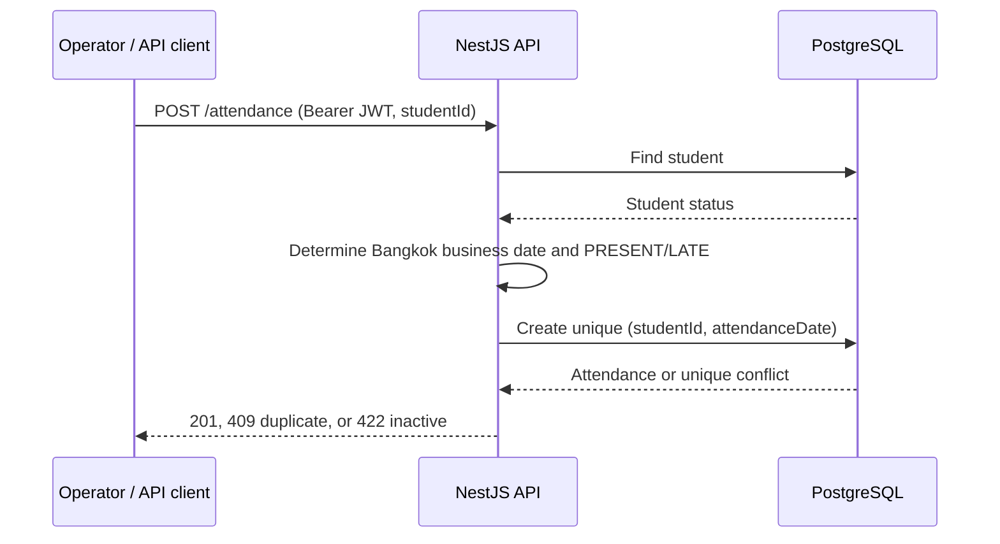

# NextSchool Attendance Operations

ระบบ REST API และแดชบอร์ดบริหารการเช็คชื่อนักเรียน สำหรับงาน technical assignment  
สร้างด้วย NestJS, Next.js, PostgreSQL, Prisma และ Docker

## Quick Start

### สิ่งที่ต้องมี

- Git
- Node.js LTS (`>=20` — สภาพแวดล้อมพัฒนานี้ใช้ Node.js 24.18.0)
- npm
- Docker Desktop

### เริ่มระบบทั้งหมด

```bash
git clone <repository-url>
cd nextschool-attendance-operations
npm install
npm run demo
```

เมื่อพร้อม ระบบจะพยายามเปิดเบราว์เซอร์ให้อัตโนมัติ

| บริการ | URL |
| --- | --- |
| Dashboard | http://localhost:3000 |
| API | http://localhost:3001 |
| Swagger | http://localhost:3001/docs |
| Health | http://localhost:3001/health |

บัญชีทดสอบ:

- Email: `admin@nextschool.local`
- Password: `Password123!`

นักเรียนตัวอย่างสำหรับ demo:

- เช็คชื่อสำเร็จ: `NS0020`
- เช็คชื่อซ้ำ (409): `NS0001`
- นักเรียนไม่ใช้งาน (422): `NS0021`

### หยุด / ดู log / รีเซ็ต

```bash
npm run demo:stop
npm run demo:logs
npm run demo:status
npm run demo:smoke
npm run demo:reset
```

คำสั่ง `npm run demo` จะสร้างไฟล์ `.env.demo.local` จาก `.env.demo.example` (ครั้งแรกเท่านั้น)  
จากนั้น build สแต็ก demo ที่แยกจากโหมดพัฒนา, migrate, seed, รัน smoke test และเปิดแดชบอร์ดเมื่อพร้อม

## สถาปัตยกรรม



เว็บใช้แนว BFF และเก็บ session ในคุกกี้แบบ HttpOnly  
`INTERNAL_API_URL` ใช้เฉพาะฝั่งเซิร์ฟเวอร์ ไม่เปิดผ่าน `NEXT_PUBLIC_*` ให้เบราว์เซอร์เรียก API โดยตรงด้วย JWT ใน JavaScript

## โมเดลข้อมูล



## ลำดับการเช็คชื่อ



## API

| Method | Path | Auth | หน้าที่ |
| --- | --- | --- | --- |
| POST | `/login` | ไม่ต้อง | ออก JWT access token |
| GET | `/health` | ไม่ต้อง | ตรวจว่าโปรเซสยังทำงาน |
| GET | `/ready` | ไม่ต้อง | ตรวจความพร้อม รวมการเชื่อมต่อฐานข้อมูล |
| GET | `/students` | Bearer JWT | ค้นหา / กรอง / เรียง / แบ่งหน้า นักเรียน |
| POST | `/attendance` | Bearer JWT | เช็คชื่อนักเรียน 1 คน |
| GET | `/attendance/summary` | Bearer JWT | สรุปจำนวนและอัตราการเข้าเรียน |
| GET | `/docs` | ไม่ต้อง | เอกสาร Swagger แบบโต้ตอบได้ |

## สถานการณ์ Demo

| นักเรียน | ผลที่คาดหวัง |
| --- | --- |
| `NS0020` | เช็คชื่อสำเร็จ (`201`) |
| `NS0001` | มีข้อมูลวันนี้แล้ว; เช็คซ้ำได้ `409` |
| `NS0021` | สถานะ INACTIVE; ปฏิเสธด้วย `422` |

คำสั่ง smoke จะลบ attendance ของ `NS0020` ในวันธุรกิจ Bangkok วันนี้ภายในฐานข้อมูล demo ก่อนทดสอบเคสสำเร็จ  
เพื่อให้รันซ้ำได้โดยไม่ต้องสร้าง API สำหรับรีเซ็ตในระบบจริง

## กฎทางธุรกิจ

- ต้องยืนยันตัวตนก่อนอ่านนักเรียนหรือจัดการเช็คชื่อ
- เฉพาะนักเรียน `ACTIVE` เท่านั้นที่เช็คชื่อได้
- นักเรียนหนึ่งคนมี attendance ได้ไม่เกิน 1 แถวต่อวันธุรกิจ Bangkok  
  บังคับทั้งในโค้ดแอปและ unique constraint ของฐานข้อมูล
- สถานะ `PRESENT` / `LATE` คำนวณจากนาฬิกาฝั่งเซิร์ฟเวอร์ตามโซน `Asia/Bangkok`
- Login มี rate limit; ไม่บันทึก password หรือ secret ลง log

## ตารางเชื่อมโยงความต้องการ

| ความต้องการ | หลักฐาน |
| --- | --- |
| ให้ reviewer เริ่มระบบได้ง่าย | `npm run demo`, `scripts/demo.mjs` |
| ข้อมูลทำซ้ำได้ | Prisma migration/seed และ `demo:reset` |
| ความปลอดภัยของ API | validation, JWT guard, Helmet, rate limiting |
| ตรวจระบบอัตโนมัติ | `scripts/demo-smoke.mjs` |
| แยกเว็บกับ API | `INTERNAL_API_URL` และคุกกี้ HttpOnly ผ่าน BFF |
| ฐานข้อมูลโหมดพัฒนา | `docker-compose.yml` ใช้พอร์ตโฮสต์ `5433` |

## แก้ปัญหาเบื้องต้น

- **Docker ไม่ทำงาน:** เปิด Docker Desktop แล้วรัน `npm run demo` อีกครั้ง
- **พอร์ต 3000 หรือ 3001 ถูกใช้:** ปิดโปรเซสที่ชน หรือเปลี่ยนพอร์ตในไฟล์ demo  
  ระบบ doctor จะแจ้งก่อนสร้างคอนเทนเนอร์
- **ชนกับ PostgreSQL บน Windows:** โหมดพัฒนาแมปพอร์ตคอนเทนเนอร์ `5432` ไปโฮสต์ `5433`  
  ให้เชื่อมต่อที่ `localhost:5433` หากโฮสต์มี Postgres ที่ `5432` อาจเจอ error ล็อกอินฐานข้อมูลที่ทำให้เข้าใจผิด
- **ต้องการข้อมูลใหม่:** รัน `npm run demo:reset` ยืนยัน แล้วตามด้วย `npm run demo`
- **เริ่มระบบไม่สำเร็จ:** ดู log ด้วย `npm run demo:logs`

## อ่านเพิ่ม

- [การตัดสินใจออกแบบ](DESIGN.md)
- [สคริปต์สาธิต 5 นาที](DEMO.md)
- [การเปิดเผยการใช้ AI](AI_USAGE.md)
- [เงื่อนไขการใช้งานเพื่อประเมินผล](LICENSE)
