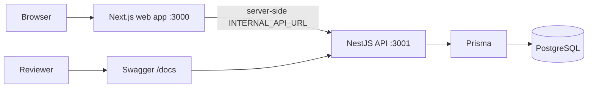
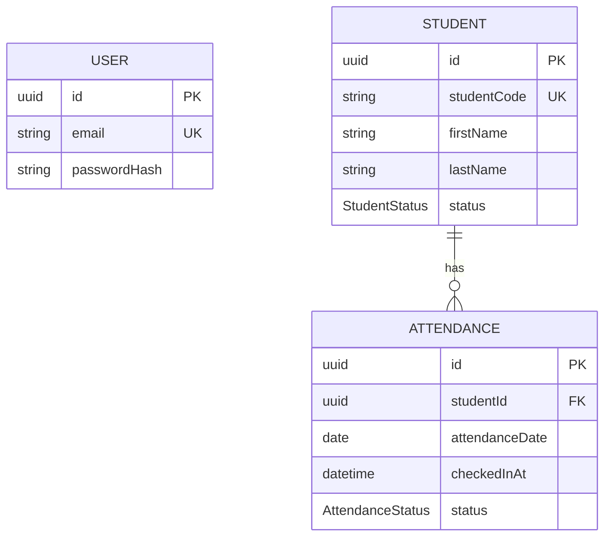

# NextSchool Attendance Operations

ระบบ REST API และแดชบอร์ดบริหารการเช็คชื่อนักเรียน สำหรับงาน technical assignment  
สร้างด้วย NestJS, Next.js, PostgreSQL, Prisma และ Docker

> งานชิ้นนี้เป็น **production-minded technical-assignment implementation**  
> มี REST API ที่ทดสอบแล้ว, reference client แบบโฟกัส, เอกสาร trade-off และแนวทางต่อยอดสู่ production  
> **ยังไม่ใช่ระบบ production-ready เต็มรูปแบบ**

## Quick Start

### สิ่งที่ต้องมี

- Git
- Node.js LTS (`>=20` — สภาพแวดล้อมพัฒนานี้ใช้ Node.js 24.18.0)
- npm
- Docker Desktop

### เริ่มระบบทั้งหมด

```bash
git clone https://github.com/sukitkhothui590-dot/nextschool-attendance-api.git
cd nextschool-attendance-api
npm install
npm run demo
```

เมื่อพร้อม ระบบจะพยายามเปิดเบราว์เซอร์ให้อัตโนมัติ

| บริการ | URL |
| --- | --- |
| Dashboard | http://localhost:3000 |
| API | http://localhost:3001 |
| Swagger | http://localhost:3001/docs |
| Health | http://localhost:3001/health |
| Readiness | http://localhost:3001/ready |

บัญชีทดสอบ:

- Email: `admin@nextschool.local`
- Password: `Password123!`

นักเรียนตัวอย่างสำหรับ demo:

- เช็คชื่อสำเร็จ: `NS0020`
- เช็คชื่อซ้ำ (409): `NS0001`
- นักเรียนไม่ใช้งาน (422): `NS0021`

### หยุด / ดู log / รีเซ็ต

```bash
npm run demo:stop
npm run demo:logs
npm run demo:status
npm run demo:smoke
npm run demo:reset
```

คำสั่ง `npm run demo` จะสร้างไฟล์ `.env.demo.local` จาก `.env.demo.example` (ครั้งแรกเท่านั้น)  
จากนั้น build สแต็ก demo, migrate, seed, รัน smoke test และเปิดแดชบอร์ดเมื่อพร้อม

### วิธีส่งงาน (ตามโจทย์)

1. Push โค้ดขึ้น GitHub
2. ส่งลิงก์ repository ไปที่ `info@nextgensoft.co.th` ภายใน 3 วัน

Repository นี้: https://github.com/sukitkhothui590-dot/nextschool-attendance-api

## ขอบเขตงาน

### สิ่งที่ทำ

- REST API ตามโจทย์: login, students, attendance, attendance summary
- กฎธุรกิจ Active-only, หนึ่งครั้งต่อวัน, Late หลัง 08:30 Bangkok
- เอกสาร README / DESIGN / AI_USAGE
- แดชบอร์ดอ้างอิงสำหรับสาธิต workflow
- ชุดทดสอบและ Swagger

### สิ่งที่ตั้งใจไม่ทำ

- CRUD นักเรียน, หลายโรงเรียน, บทบาทซับซ้อน
- parent app, QR, Excel/PDF export, realtime
- refresh token rotation / OAuth / registration

รายละเอียดเหตุผลอยู่ใน [DESIGN.md](DESIGN.md)

## โครงสร้างโปรเจกต์

```text
nextschool-attendance-api/
├── apps/
│   ├── api/                 # NestJS REST API (ของหลัก)
│   │   ├── prisma/          # schema, migrations, seed
│   │   ├── src/             # auth, students, attendance, common
│   │   └── test/            # e2e tests
│   └── web/                 # Next.js dashboard + BFF routes
├── scripts/                 # npm run demo* (cross-platform)
├── docker-compose.yml       # Postgres โหมดพัฒนา (host :5433)
├── docker-compose.demo.yml  # reviewer stack แบบครบ
├── README.md
├── DESIGN.md
├── AI_USAGE.md
└── DEMO.md
```

ทิศทาง dependency ของ API:

`Controller → Service → Repository → Prisma → PostgreSQL`

## สถาปัตยกรรม



- แดชบอร์ดใช้ BFF + คุกกี้ HttpOnly
- `INTERNAL_API_URL` ใช้เฉพาะฝั่งเซิร์ฟเวอร์
- reviewer เรียก API โดยตรงผ่าน curl / Swagger ได้เสมอ

## การออกแบบฐานข้อมูล



สรุปสั้น ๆ:

- `attendanceDate` = `DATE` ของวันธุรกิจ Bangkok
- `checkedInAt` = `TIMESTAMPTZ` ของเวลาจริง
- unique `(studentId, attendanceDate)` กันเช็คชื่อซ้ำ
- ไม่เก็บแถว Absent; คำนวณจากจำนวน ACTIVE

รายละเอียด trade-off ดูใน [DESIGN.md](DESIGN.md)

## Assumptions ที่ตัดสินใจเอง

| หัวข้อ | Assumption |
| --- | --- |
| เวลาธุรกิจ | ใช้ `Asia/Bangkok` |
| จุดตัดสาย | หลัง `08:30:00.000` = LATE, ตรง `08:30:00.000` = PRESENT |
| เจ้าของเวลาเช็คชื่อ | เซิร์ฟเวอร์เท่านั้น ไคลเอนต์ส่งได้แค่ `studentId` |
| Absent | `ACTIVE − PRESENT − LATE` ไม่เก็บในตาราง |
| Summary ย้อนหลัง | อิงสถานะ ACTIVE ปัจจุบัน เพราะโจทย์ไม่มีประวัติสถานะ |
| แดชบอร์ด | เป็น reference client ไม่แทน API |
| โหมด demo | ใช้ Docker แยกจากโหมดพัฒนา |

## API

เอกสารโต้ตอบได้ที่ http://localhost:3001/docs

| Method | Path | Auth | หน้าที่ |
| --- | --- | --- | --- |
| POST | `/login` | ไม่ต้อง | ออก `access_token` |
| GET | `/health` | ไม่ต้อง | liveness |
| GET | `/ready` | ไม่ต้อง | readiness + DB |
| GET | `/students` | JWT | ค้นหา / กรอง / เรียง / แบ่งหน้า |
| POST | `/attendance` | JWT | เช็คชื่อ 1 คน |
| GET | `/attendance/summary` | JWT | สรุป Present / Late / Absent |
| GET | `/docs` | ไม่ต้อง | Swagger UI |

### ตัวอย่าง login

```bash
curl -X POST http://localhost:3001/login \
  -H "Content-Type: application/json" \
  -d "{\"email\":\"admin@nextschool.local\",\"password\":\"Password123!\"}"
```

### รูปแบบ response

สำเร็จ:

```json
{ "success": true, "data": {} }
```

รายการพร้อม meta:

```json
{
  "success": true,
  "data": [],
  "meta": { "page": 1, "limit": 20, "total": 24, "totalPages": 2 }
}
```

ผิดพลาด:

```json
{
  "success": false,
  "error": {
    "code": "STUDENT_INACTIVE",
    "message": "Only active students may check in.",
    "details": null
  },
  "requestId": "..."
}
```

## กฎทางธุรกิจ

- เฉพาะนักเรียน `ACTIVE` เช็คชื่อได้
- เช็คชื่อได้วันละ 1 ครั้งต่อคน ตามวันธุรกิจ Bangkok
- หลัง 08:30 Bangkok = `LATE`
- เซิร์ฟเวอร์เป็นผู้กำหนดเวลาเช็คชื่อ
- login มี rate limit และไม่ log รหัสผ่าน/โทเคน

## สถานการณ์ Demo

| นักเรียน | ผลที่คาดหวัง |
| --- | --- |
| `NS0020` | เช็คชื่อสำเร็จ (`201`) |
| `NS0001` | ซ้ำ (`409`) |
| `NS0021` | INACTIVE (`422`) |

## โหมดพัฒนา (สำหรับแก้โค้ด)

แยกจาก reviewer demo:

```bash
npm run db:up
npm run db:migrate
npm run db:seed
npm run dev:api
npm run dev:web
```

Postgres โหมดพัฒนาอยู่ที่ `localhost:5433`  
(กันชนกับ PostgreSQL บน Windows ที่พอร์ต 5432)

คำสั่งตรวจคุณภาพหลัก:

```bash
npm run typecheck
npm run test
npm run test:e2e
npm run build
```

## ตารางเชื่อมโยงความต้องการ

| ความต้องการ | การทำ | วิธีตรวจ |
| --- | --- | --- |
| Login ได้ access token | Auth module | e2e + smoke |
| ค้นหา/แบ่งหน้า/เรียง/กรองนักเรียน | Students module | e2e |
| เช็คชื่อ Active เท่านั้น | Attendance service | e2e 422 |
| วันละครั้ง | unique constraint | e2e 409 + concurrent |
| Late หลัง 08:30 | domain + Clock | unit/e2e boundary |
| Summary Present/Late/Absent | aggregate queries | e2e + dashboard |
| เอกสารและ trade-off | README/DESIGN/AI_USAGE | ตรวจด้วยตา + สัมภาษณ์ |

## แก้ปัญหาเบื้องต้น

- **Docker ไม่ทำงาน:** เปิด Docker Desktop แล้วรัน `npm run demo` อีกครั้ง
- **พอร์ต 3000/3001 ถูกใช้:** ปิดโปรเซสที่ชน หรือปรับพอร์ตใน `.env.demo.local`
- **ชน Postgres บน Windows:** ใช้ `localhost:5433` ในโหมดพัฒนา
- **อยากได้ข้อมูลใหม่:** `npm run demo:reset` แล้วตามด้วย `npm run demo`
- **สตาร์ทไม่สำเร็จ:** `npm run demo:logs`

## อ่านเพิ่ม

- [DESIGN.md](DESIGN.md) — เหตุผลการออกแบบและข้อแลกเปลี่ยน
- [DEMO.md](DEMO.md) — สคริปต์สาธิต 5 นาที
- [AI_USAGE.md](AI_USAGE.md) — การใช้ AI และการตรวจแก้
- [LICENSE](LICENSE) — ใช้เพื่อประเมินผลเท่านั้น
