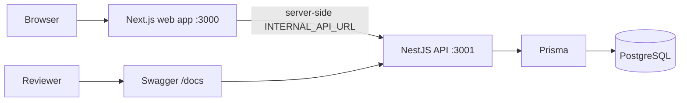
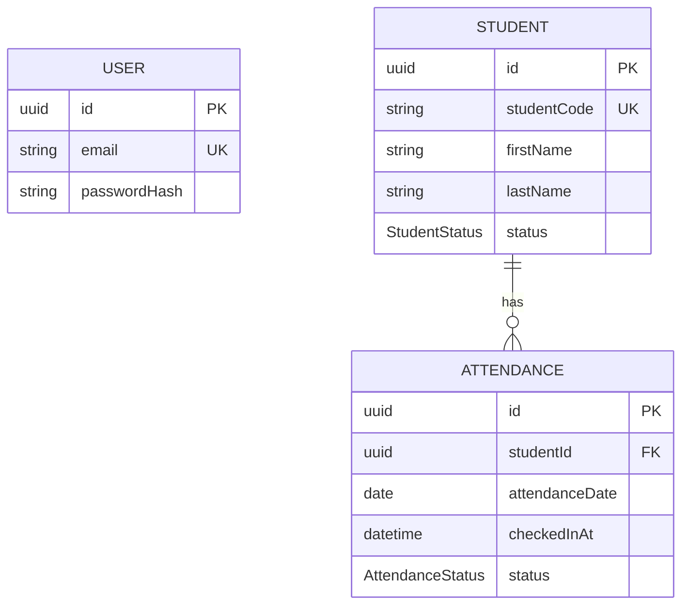
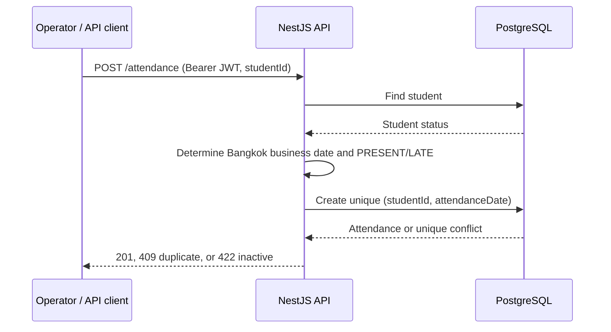

# NextSchool Attendance Operations

Reviewer-ready attendance API and operations dashboard built with NestJS, Next.js, PostgreSQL, Prisma, and Docker.

## Quick Start

Requirements: Docker Desktop running, Docker Compose v2, Node.js `>=20` (the repository supports Node 24), and npm.

```bash
npm run demo
```

The command creates `.env.demo.local` from `.env.demo.example` once, builds the isolated demo stack, migrates and seeds the database, runs smoke checks, and opens the dashboard when possible.

| Service | URL |
| --- | --- |
| Operations dashboard | http://localhost:3000 |
| API | http://localhost:3001 |
| Swagger API docs | http://localhost:3001/docs |

Demo administrator: `admin@nextschool.local` / `Password123!`

Useful commands:

```bash
npm run demo:status
npm run demo:logs
npm run demo:smoke
npm run demo:stop
npm run demo:reset # deletes demo database data after confirmation
```

## Architecture



The web application uses a BFF-style server boundary and HttpOnly session cookies. `INTERNAL_API_URL` is server-only; no `NEXT_PUBLIC_*` API URL is exposed to the browser.

## Data Model



## Check-in Flow



## API

| Method | Path | Auth | Purpose |
| --- | --- | --- | --- |
| POST | `/login` | No | Return JWT access token |
| GET | `/health` | No | Liveness probe |
| GET | `/ready` | No | Readiness probe with database check |
| GET | `/students` | Bearer JWT | Search, filter, sort, and page students |
| POST | `/attendance` | Bearer JWT | Check in one student |
| GET | `/attendance/summary` | Bearer JWT | Attendance counts and rate |
| GET | `/docs` | No | Interactive Swagger documentation |

## Demo Scenarios

| Student | Expected result |
| --- | --- |
| `NS0020` | Successful check-in (`201`) |
| `NS0001` | Already seeded today; duplicate check-in (`409`) |
| `NS0021` | Inactive; check-in rejected (`422`) |

The smoke command deletes today's Bangkok-date attendance for `NS0020` directly inside the isolated demo database before its success assertion. This keeps the success path repeatable without introducing a production reset API.

## Business Rules

- Only authenticated users can read students or manage attendance.
- A student must be `ACTIVE` to check in.
- One attendance row is allowed per student per Bangkok business date; the rule is enforced by both application logic and a database unique constraint.
- Attendance is classified as `PRESENT` or `LATE` using the Bangkok business clock.
- Login attempts are rate limited; secrets and passwords are not logged.

## Requirement Traceability

| Requirement | Evidence |
| --- | --- |
| Reviewer startup | `npm run demo`, `scripts/demo.mjs` |
| Repeatable data | Prisma migration/seed plus `demo:reset` |
| API safety | Nest validation, JWT guard, Helmet, rate limiting |
| Demo verification | `scripts/demo-smoke.mjs` checks all requested paths |
| Web/API separation | `INTERNAL_API_URL` and HttpOnly BFF cookies |
| Local developer database | `docker-compose.yml` remains on host port `5433` |

## Troubleshooting

- **Docker daemon unavailable:** start Docker Desktop, then rerun `npm run demo`.
- **Port 3000 or 3001 occupied:** stop the conflicting process or update the local demo ports. The doctor reports the conflict before starting containers.
- **Windows PostgreSQL conflict:** developer-mode Postgres deliberately maps container port `5432` to host port `5433` in `docker-compose.yml`. Use `localhost:5433` for local developer database connections; a host Postgres on `5432` can otherwise produce misleading authentication failures.
- **Fresh data needed:** run `npm run demo:reset`, confirm deletion, then `npm run demo`.
- **Startup failed:** inspect container output with `npm run demo:logs`.

## Further Reading

- [Design decisions](DESIGN.md)
- [Five-minute reviewer walkthrough](DEMO.md)
- [AI usage disclosure](AI_USAGE.md)
- [Evaluation-only license](LICENSE)
